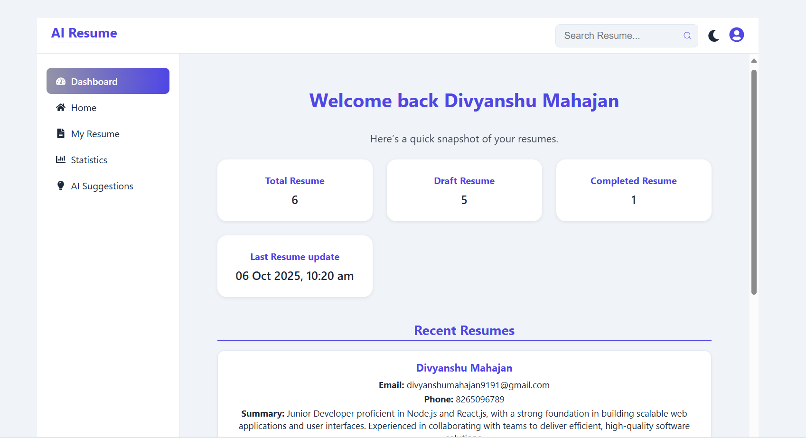
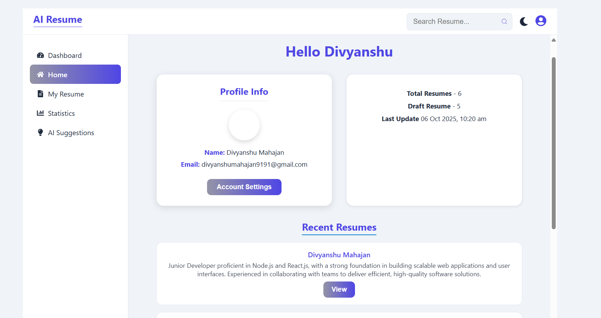

# 🧠 AI Resume Builder

A full-stack **AI-powered Resume Builder** that helps users create professional, ATS-friendly resumes in minutes.  
Built with the **MERN stack**, it leverages AI to automatically generate **summaries, project descriptions, and job responsibilities** based on user input — saving time and improving quality.

---

## 🚀 Features

### 🔹 Core Functionality
- Create, edit, and preview resumes in real-time  
- Multiple **modern, responsive templates** (grid, sidebar, timeline, etc.)  
- Dynamic data binding via **Redux Toolkit**  
- **PDF export** using `html2pdf.js`  
- **Light/Dark mode** toggle with persistent theme storage  

### 🤖 AI Integration
- Generate **professional summaries**
- Auto-generate **experience responsibilities**
- AI-powered **education and project descriptions**
- Custom backend routes to handle AI responses (Node.js + Express)

### 🔒 Authentication
- Secure user authentication with **JWT** and **bcrypt**
- **Forgot password** and **reset password** functionality via email
- Persistent login using localStorage

---

## 🏗️ Tech Stack

| Layer | Technologies |
|-------|---------------|
| **Frontend** | React 19, Redux Toolkit, React Router DOM 7, Vite |
| **Styling & UI** | CSS Modules, React Icons, FontAwesome |
| **Backend** | Node.js, Express.js, MongoDB, Mongoose |
| **Security** | JWT Authentication, bcrypt Encryption |
| **Utilities** | Nodemailer, dotenv, html2pdf.js |
| **State Management** | Redux Toolkit |
| **Data Visualization** | Recharts |

---

### ScreenShot

 

 

 

 

 

 

 

 

 

 

 

 

 

 

 

 

 

 

 

 

 


 ---

## 📁 Folder Structure

```bash

ai-resume-builder/
├── client/
│   ├── node_modules/
│   ├── public/
│   ├── src/
│   │   ├── assets/
│   │   ├── components/
│   │   ├── hooks/
│   │   ├── Layout/
│   │   ├── pages/
│   │   ├── redux/
│   │   ├── templates/
│   │   ├── UI/
│   │   ├── App.css
│   │   ├── App.jsx
│   │   ├── index.css
│   │   ├── main.jsx
│   │   └── env
│   ├── .gitignore
│   └── package.json
│
├── server/
│   ├── node_modules/
│   ├── controllers/
│   ├── db/
│   ├── middlewares/
│   ├── models/
│   ├── routes/
│   ├── utils/
│   ├── .env
│   ├── .gitignore
│   ├── app.js
│   ├── constants.js
│   ├── package-lock.json
│   ├── package.json
│   └── sample.env
│
└── README.md

```

---

## ⚙️ Environment Variables

You can copy these from `.env.sample` and configure them for your environment.

### 🧩 Server `.env`
```bash
PORT=5000
MONGO_URI=your_mongodb_connection_string
JWT_SECRET=your_secret_key
EMAIL_USER=your_email@example.com
EMAIL_PASS=your_email_password
REFRESH_TOKEN_SECRET=your_REFRESH_TOKEN_EXPIRY_secret
REFRESH_TOKEN_EXPIRY=your_REFRESH_TOKEN_EXPIRY_time
ACCESS_TOKEN_SECRET=your_ACCESS_TOKEN_EXPIRY_secret
ACCESS_TOKEN_EXPIRY=your_ACCESS_TOKEN_EXPIRY_time
CORS_ORIGIN=*


```
### 🧩 Client `.env`

```bash

CLIENT_URL=http://localhost:5173

```
### Clone Repository

```bash

git clone  https://github.com/Divyanshu-Mahajan/ai-resume-builder.git
cd ai-resume-builder


```

# Frontend

```bash

cd client
npm install

```

# Backend

```bash
cd server
npm install


```

### Run the project

# Backend

```bash
npm run start

```
# Frontend (in another terminal)

```bash
npm run dev

```


## 📜 License

This project is licensed under the **MIT License** — you’re free to use, modify, and distribute it with attribution.

---

**👨‍💻 Divyanshu Mahajan**  
📧 [divyanshumahajan9191@gmail.com]  
🔗 [LinkedIn](https://linkedin.com/in/your-profile) | [GitHub](https://github.com/Divyanshu-Mahajan)

---